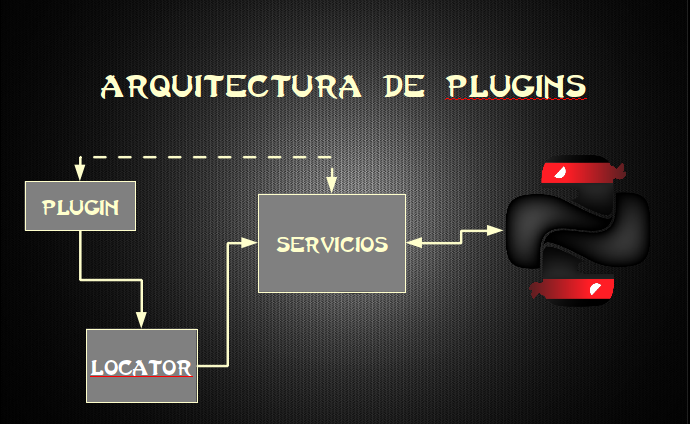
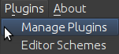
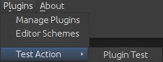
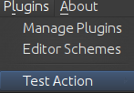
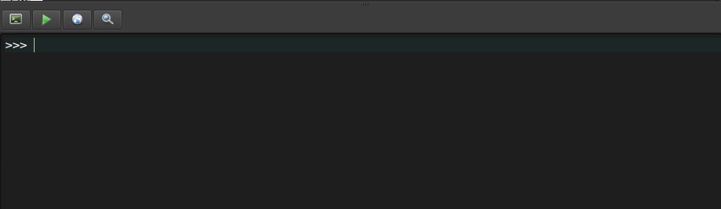
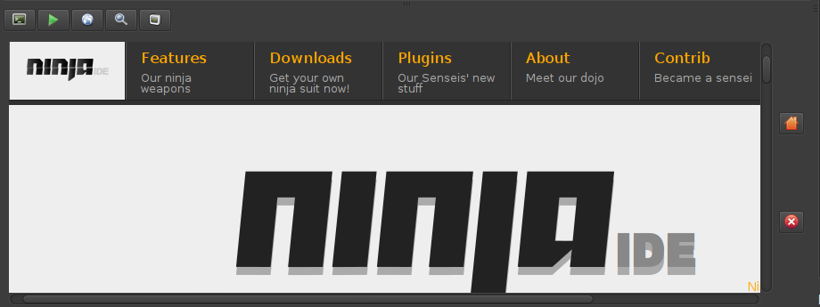
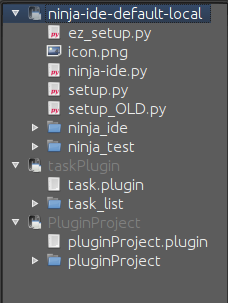
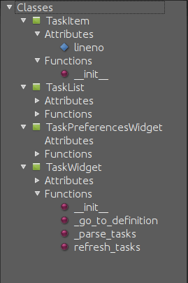
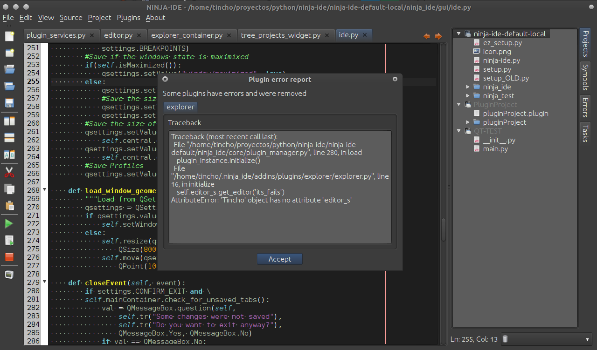

===============
Plugin Tutorial
===============

Why do we need plugins on NINJA-IDE?
====================================

Plugins are small pieces of code that can interact with NINJA-IDE and add
specific features to it. This is useful if you want to have special features
that NINJA-IDE does not provide.

Many times developers around the world try to collaborate on an open source
project, but that task could be hard for many reasons. In these cases plugins
are a good option to collaborate. You just need to learn the project API.

Architecture
============

The image above shows the connection between plugins and NINJA-IDE. Plugins get
services by using a service locator. The service locator returns the specific
service and the plugin uses this service to talk with NINJA-IDE.

.. _createPlugin:

How to create plugins
=====================

We recommend that you install and use the oficial plugin called
**pluginProject**. That plugin helps you to create the skeleton of all plugins
for NINJA-IDE. That plugin allows you to test your plugin on NINJA-IDE as well
and packages your plugin to share it. You can install**pluginProject** from the
Plugin Manager inside NINJA-IDE (Go to the Plugins menu and choose
*Manage Plugins*).

.. image:: ../images/install_screen.png
   :align: center

Plugin Descriptor file
----------------------

This is just a JSON notation file with the extension “.plugin”. This file helps
NINJA-IDE to detect and manage your plugin. The following information about the
plugin should be included:::

    {
      "module": "my_plugin",
      "class": "MyPluginExample",
      "authors": "Martin Alderete <malderete@gmail.com>",
      "version": "0.1",
      "url": "http://code.google.com/p/ninja-ide",
      "description": "This plugin is a test"
    }

-  module: Indicates the name of the module where the plugin class
   resides, which will be instantiated by NINJA-IDE.
-  class: Indicates the name of the class which implements the plugin.
-  authors: String with the author(s).
-  version: Indicates the plugin version.
-  url: Indicates the url of the plugin (the documentation could be provided
   here).
-  description: Plugin description.

Service locator class
---------------------

This class provides an easy way to request and get the NINJA-IDE services for
your plugin. This class has two methods: one to get a service and one to get the
names of all available services.

To get a service::

    one_service = service_locator.get_service("name_of_the_Service")

To check all the available services::

       for service_name in service_locator.get_availables_services():
          print service_name

Plugin class
------------

All plugins must inherit from this class. This is the base class that NINJA-IDE
provides to create plugins. This class also inherits from
`QObject <http://qt-project.org/doc/qt-5.0/qtcore/qobject.html>`_. Because
of that your plugins are compatible with
`signals/slots <http://qt-project.org/doc/qt-5.0/qtcore/signalsandslots.html>`_
of the Qt library.

Attributes
~~~~~~~~~~

-  self.metadata: A Python Dictionary with the contents of the plugin descriptor
   file.
-  self.locator: An instance of the ServiceLocator class.
-  self.path: A string with the plugin directory.
-  self.logger: An instance of `PluginLogger`_.

PluginLogger
~~~~~~~~~~~~

This is the logger for plugins. It allows to record events occured on plugins.
This is a wrapper over the logging.Logger class of the
`logging <http://docs.python.org/library/logging.html#logger-objects>`_ module.

Methods
~~~~~~~

.. method:: initialize

This method is called by NINJA-IDE when your plugin is ready to start.
This is the recommended place to request/get the NINJA-IDE services for
your plugin.

.. method:: finish

This method is called when NINJA-IDE is shutting down.

.. method:: get\_preferences\_widget

This method is called by NINJA-IDE when the user opens the preferences dialog.
This method allows us to integrate a custom configuration widget in the
NINJA-IDE preferences. It is important that this is TRUNCATED! Please download
`pandoc <http://johnmacfarlane.net/pandoc/>`_ if you want to convert large
files.

Example
~~~~~~~

::

    from ninja_ide.core import plugin
    from ninja_ide.core import plugin_interfaces
    from PyQt4.QtGui
    import QWidget
    
    class MyPluginExample(plugin.Plugin):
    
        def initialize(self):
            print "The plugin is loading..."
            print "plugin information: %s" % self.metadata
            print "service locator: %s" % self.locator
     
       def finish(self):
            print "The plugin is shutting down because the user has closed NINJA-IDE"
     
       def get_preferences_widget(self):
            pass

Plugins interfaces
------------------

Some actions from plugins require objects with special interfaces. Here we
describe the possible interfaces.

IProjectTypeHandler
~~~~~~~~~~~~~~~~~~~

This interface is useful if you want to add a new type of project to
NINJA-IDE.::

        def get_pages(self):
            """
            Should return a collection of QWizardPage or subclass
            """

        def on_wizard_finish(self, wizard):
            """
            Called when the user finishes the wizard
            """

        def get_context_menus(self):
            """
            Should return an iterable of QMenu for the context type of the new project type
            """

ISymbolsHandler
~~~~~~~~~~~~~~~

This interface is useful if you want to provide symbols for a language distinct
of Python.

IPluginPreferences
~~~~~~~~~~~~~~~~~~

This interface is useful if you want to add custom preferences for your
plugin.::

    def obtain_symbols(self, source):
        """ 
        Returns the dict needed by the tree
        Source code in plain text
        """

NOTE: Must return the following structure::

       {
             'attributes': {name: line, name: line},
             'functions':  {name: line, name: line},
             'classes':     {name: (line, {
                                    'attributes': {name: line},
                                    'function': {name: line}}
                                    )         
                             }     
       }

Services
--------

Services are the way that plugins talk with NINJA-IDE. Conceptually services
are proxies to NINJA-IDE components. NINJA-IDE defines differents components,
each one of these has differents features.

editor
~~~~~~

This service allows to interact with the main parts of NINJA-IDE, such as the
editor, the tab manager, listen to signals which NINJA-IDE emits when saving
a file, save project, change the current tab, etc.

Signals
:::::::

.. method:: editorKeyPressEvent(QEvent)

Emitted when the user presses a key.

To connect the plugin to this signal use::

    SERVICE_NAME = "editor"
    editor_service = self.locator.get_service(SERVICE_NAME)
    editor_service.editorKeyPressEvent.connect(self._do_something)
    
    def do_something(self, event):
        #the code goes here!

.. method:: beforeFileSaved(fileName)

Emitted **before** the fileName is saved on disc.

To connect the plugin to this signal use::

    SERVICE_NAME = "editor"
    editor_service = self.locator.get_service(SERVICE_NAME)
    editor_service.beforeFileSaved.connect(self._do_something)
    
    def do_something(self, fileName):
        #the code goes here!

.. method:: fileSaved(fileName)

Emitted when the user saves a file.

To connect the plugin to this signal use::

    SERVICE_NAME = "editor"
    editor_service = self.locator.get_service(SERVICE_NAME)
    editor_service.fileSaved.connect(self._do_something)
    
    def do_something(self, fileName):
        #the code goes here!

.. method:: currentTabChanged(fileName)

Emitted when the user changes the current tab.

To connect the plugin to this signal use::

    SERVICE_NAME = "editor"
    editor_service = self.locator.get_service(SERVICE_NAME)
    editor_service.currentTabChanged.connect(self._do_something)
    
    def do_something(self, fileName):
        #the code goes here!

.. method:: fileExecuted(fileName)

Emitted when the user executes a file.

To connect the plugin to this signal use::

    SERVICE_NAME = "editor"
    editor_service = self.locator.get_service(SERVICE_NAME)
    editor_service.fileExecuted.connect(self._do_something)
    
    def do_something(self, fileName):
        #the code goes here!

.. method:: fileOpened(fileName)

Emitted when the user opens a file

To connect the plugin to this signal use::

    SERVICE_NAME = "editor"
    editor_service = self.locator.get_service(SERVICE_NAME)
    editor_service.fileOpened.connect(self._do_something)
    
    def do_something(self, fileName):
        #the code goes here!

Methods
:::::::

.. method:: get\_tab\_manager(self)

This method returns the TabWidget
(ninja\_ide.gui.main\_panel.tab\_widget.TabWidget) subclass of
`QTabWidget <http://qt-project.org/doc/qt-5.0/qtwidgets/qtabwidget.html>`_.

.. method:: add\_menu(self, menu, lang=".py")

This method adds an extra context menu to the editor's context menu
(`QMenu <http://qt-project.org/doc/qt-5.0/qtwidgets/qmenu.html>`_).

.. method:: get\_opened\_documents(self)

This method returns the name of the open file(s).

.. method:: add\_editor(self, fileName="", content=None, syntax=None)

This method creates a new editor.

- fileName: Absolute path to a file
- content: Content for the editor if not fileName
- syntax: Syntax name, for example python

If the method is called without fileName and content an empty editor is created.

.. method:: get\_editor(self)

This method returns the actual editor (instance of
ninja\_ide.gui.editor.Editor). This method could return None.

.. method:: get\_editor\_path(self)

This method returns the actual editor's path. This method could return None
if there isn't an editor.

.. method:: get\_project\_owner(self, editorWidget=None)

This method returns the project where the current file in the editor belongs to,
or an empty string (if the Editor Widget is not specified it returns the
information from the current editor in focus).

.. method:: get\_text(self)

This method returns the plain text of the current editor, or None if there isn't
an editor.

.. method:: get\_selected\_text(self)

This method returns the selected text of an editor. This method could return
None.

.. method:: insert\_text(self, text)

This method inserts text into the current cursor position.

.. method:: get\_file\_syntax(self, editorWidget=None)

This method returns the syntax for the current file. The syntax is represented
as a dictionary that contains the descriptor that Ninja recognizes for each
language (if the Editor Widget is not specified it returns the information from
the current editor in focus).

.. method:: jump\_to\_line(self, lineno)

This method jumps to a specific line in the current editor.

.. method:: get\_lines\_count(self)

This method returns the count of lines in the current editor.

.. method:: save\_file(self)

This method saves the actual file.

.. method:: open\_files(self, files, mainTab=True)

This method opens multiple files, each one in a different editor.

.. method:: open\_file(self, fileName='', cursorPosition=0, positionIsLineNumber=False)

This method opens a single file. If the file is already open it gets in focus.

.. method:: open\_image(self, filename)

This method opens a single image.

toolbar
~~~~~~~

This service allows to interact with the toolbar of NINJA-IDE. The toolbar is
an instance of `QToolbar <http://qt-project.org/doc/qt-5.0/qtwidgets/qtoolbar.html>`_, so
we can add actions (`QAction <http://qt-project.org/doc/qt-5.0/qtwidgets/qaction.html>`_)
to it.

By default the toolbar of NINJA-IDE looks like the image below:

Methods
:::::::

.. method:: add\_action(self, action)

This method allows to add an action (`QAction`_) to the toolbar.

To add one action use::

    SERVICE_NAME = "toolbar"
    toolbar_service = self.locator.get_service(SERVICE_NAME)
    
    #instanciate a QAction (or subclass)
    one_Action = QAction(...)
    
    #add the action to the toolbar of NINJA-IDE
    toolbar_service.add_action(one_action)

When this code is added, the toolbar of NINJA-IDE looks like this:

Great! We have added an action to the toolbar of NINJA-IDE.

menuApp
~~~~~~~

This service allows to interact with the **Plugins** menu of NINJA-IDE.
We can insert menus (`QMenu`_) or/and actions (`QAction`_).

By default the Plugins Menu of NINJA-IDE looks like the image below:

Methods
:::::::

.. method:: add\_menu(self, menu)

This method allows to add a menu (`QMenu`_)
to the NINJA-IDE plugins menu.

To add one menu to the NINJA-IDE use::

    SERVICE_NAME = "menuApp"
    menu_service = self.locator.get_service(SERVICE_NAME)
    
    #instanciate a QMenu (or subclass)
    one_menu = QMenu(...)
    
    #add the menu to NINJA-IDE
    menu_service.add_menu(one_menu)

When this code is added, the Plugins Menu of NINJA-IDE looks like this:

.. method:: add\_action(self, action)

This method allows to add an action (`QAction`_) to the NINJA-IDE plugins menu.

To add one action to the NINJA-IDE use::

    SERVICE_NAME = "menuApp"
    menu_service = self.locator.get_service(SERVICE_NAME)
    
    #instanciate a QAction (or subclass)
    one_action = QAction(...)
    
    #add the action to NINJA-IDE
    menu_service.add_action(one_action)

When this code is added, the Plugins Menu of NINJA-IDE looks like this:

misc
~~~~

This service allows to interact with the miscellaneous container (misc) of
NINJA-IDE. This container is at the bottom of the user interface. The
container has a collection of widgets and shows an icon for each one them. 
Only one widget is visible at a time. We can add widgets
(`QWidget <http://qt-project.org/doc/qt-5.0/qtwidgets/qwidget.html>`_) to the 
misc container.

By default the Plugins Menu of NINJA-IDE looks like the image below:

The image above shows the misc container, the console and the icons.

Methods
:::::::

.. method:: add\_widget(self, widget, icon\_path, description)

This method allows to add widgets (`QWidget`_) to the misc container.

To add a widget to the misc container use::

    SERVICE_NAME = "misc"
    misc_service = self.locator.get_service(SERVICE_NAME)
    
    #instanciate a QWidget (or subclass)
    my_widget = QWidget(...)icon_path = "some_plate/where/the/icon/is.png"
    description = "This is my widget in NINJA-IDE"
    
    #add the widget to NINJA-IDE
    misc_service.add_widget(my_widget, icon_path, description)

When this code is added, the misc container of NINJA-IDE looks like this:

Great! We have added a widget with a
`QWebView <http://qt-project.org/doc/qt-5.0/qtwebkit/qwebview.html>`_ to the 
misc container of NINJA-IDE.

explorer
~~~~~~~~

This service allows to interact with the NINJA-IDE explorer container which
holds the :ref:`TreeProjectsWidget` and the :ref:`TreeSymbolsWidget`. Before we
explain the explorer service, we are going to see some important classes first.

Methods
:::::::

.. method:: get\_tree\_projects(self)

Returns the :ref:`TreeProjectsWidget`.

.. method:: get\_tree\_symbols(self)

Returns the :ref:`TreeSymbolsWidget`.

.. method:: get\_current\_project\_item(self)

Returns the current item of the tree projects (if possible).
Note: This method is a shortcut of self.get\_tree\_projects().currentItem()

.. method:: get\_project\_item\_by\_name(self, projeectName)

Return a ProjectItem based on the name provided, or None if an item with that
name can't be found.

.. method:: set\_symbols\_handler(self, file\_extension, symbols\_handler)

Add a new Symbol's handler for the given file extension.
Note: symbols\_handler SHOULD have a special interface.
See: ninja\_ide.core.plugin\_interfaces.

Example: If you want to add a new symbols handler for C++, your plugin should
include the following code::

    SERVICE_NAME = 'explorer'
    self.explorer_s = self.locator.get_service(SERVICE_NAME)  
    cpp_symbols_handler = CppSymbolHandler(...)
    self.explorer_s.set_symbols_handler('.cpp', cpp_symbols_handler)

Then all symbols in .cpp files will be handled by cpp\_symbols\_handler.

.. method:: set\_project\_type\_handler(self, project\_type, project\_type\_handler)

Add a new Project Type and the handler for it.
Note: project\_type\_handler SHOULD have a special interface.
See: ninja\_ide.core.plugin\_interfaces.

Example: If you want to add a custom type of project, your pluging should
include the following code::

    SERVICE_NAME = 'explorer'
    self.explorer_s = self.locator.get_service(SERVICE_NAME)
    foo_project_handler = FooProjectHandler(...)
    self.explorer_s.set_project_type_handler('Foo Project', foo_project_handler)

Then 'Foo Project' will appear in the New Project wizard and the
foo\_project\_handler instance controls the wizard.

.. method:: add\_tab(self, tab, title)

Add a tab (`QTabWidget`_) with the given title (string).

.. method:: get\_actual\_project(self)

Returns the path of the opened projects.

.. method:: get\_opened\_projects(self)

Returns a list of strings with the paths of the opened projects, or an
empty list if there aren't any opened projects.

.. method:: add\_project\_menu(self, menu, lang='all')

Add an extra menu(`QMenu`_)
to the project explorer for files that are specified by lang.
Note: lang is a file extension such as .php, .py, .cpp. If you want to add an
extra menu for any kind of file, you need to specify lang='all'.

Example 1: If you want to add an extra menu for Python files, your
plugin should include the following code::

    SERVICE_NAME = 'explorer'
    self.explorer_s = self.locator.get_service(SERVICE_NAME)
    extra_menu = MyCustomMenuForPHPFiles()
    self.explorer_s.add_project_menu(extra_menu, lang='.php')

Example 2: If you want to add an extra menu for all files, your plugin
should inlcude the following code::

    SERVICE_NAME = 'explorer'
    self.explorer_s = self.locator.get_service(SERVICE_NAME)
    extra_menu = MyCustomMenuForPythonFiles()
    self.explorer_s.add_project_menu(extra_menu, lang='all')

Signals
:::::::

.. method:: projectExecuted(projectPath)

Emitted when the user executes a project.

To connect the plugin to this signal use::

    SERVICE_NAME = "explorer"
    explorer_service = self.locator.get_service(SERVICE_NAME)
    explorer_service.projectExecuted.connect(self._do_something)
    
    def do_something(self, projectPath):  
        #the code goes here!

.. method:: projectOpened(projectPath)

Emitted when the user opens a project.

To connect the plugin to this signal use::

    SERVICE_NAME = "explorer"
    explorer_service = self.locator.get_service(SERVICE_NAME)
    explorer_service.projectOpened.connect(self._do_something)
    
    def do_something(self, projectPath):
        #the code goes here!

.. _TreeProjectsWidget:

TreeProjectsWidget
::::::::::::::::::

This class inherits from
`QTreeWidget <http://doc.qt.digia.com/latest/qtreewidget.html>`_ and
represents a tree with all the NINJA-IDE projects and their content
(folders and files).

ProjectTree
:::::::::::

This class inherits from
`QTreeWidgetItem <http://qt-project.org/doc/qt-5.0/qtwidgets/qtreewidget.html>`_
and is used to represent projects (root of tree).

This class contains general information about the project:

-  self.path
-  self.isFolder
-  self.projectType
-  self.description
-  self.url
-  self.license
-  self.mainFile
-  self.extensions
-  self.pythonPath
-  self.programParams
-  self.venv

.. method:: def lang(self)

Returns the programming language of the project.

.. method:: def get\_full\_path(self)

Returns the full path of the project.

ProjectItem
:::::::::::

This class inherits from `QTreeWidgetItem`_ and is used to represent the content
of projects (folder and files).

This class contains general information about the file.

-  self.path: Absolute path to the given item (folder or file).
-  self.isFolder: Boolean value depending on the item is folder or item.

.. method:: def get\_full\_path(self)

Returns the full path of the file.

.. _TreeSymbolsWidget:

TreeSymbolsWidget
:::::::::::::::::

This class inherits from `QTreeWidget`_ and represents the content of a file
**classes**, **methods**, **functions** and **global variables**. NINJA-IDE
**only** handles symbols for Python files, but we can add handlers for
different files.

The TreeSymbolsWidget class looks like this:

Testing your plugin
-------------------

There are different methods to test your plugin:

-  **Hacker way**

You have to move your plugin code and the plugin descriptor file to
~/.ninja\_ide/addins/plugins/. Re run NINJA-IDE and see what happens.

-  **pluginProject (Recommended way)**

You have to install the oficial :ref:`pluginProject <createPlugin>` plugin,
create a new project, select the **NINJA-Plugin-Project** -type and follow the
wizard. When you've finished the wizard, the new project will be opened and some
code will be included into some files. Go to the root of the project and
right-click in it. Go to **"Plugin Tools"** and then select
**"Test this plugin on NINJA-IDE"**. This will launch a new instance of
NINJA-IDE with your plugin.

-  **NINJA-IDE embedded console (Recommended way)**

You can test the NINJA-IDE plugins API using the embedded console in NINJA-IDE.
To do this you have to open the console (F4) and write your plugin code. You
will see the results in real time on NINJA-IDE.
For example, see the session below when the user is playing with the API:

.. image:: ../images/playing_with_the_API.png
   :align: center

Debugging your plugin
---------------------

When you install/test a plugin, it could fail. If the plugin fails, NINJA-IDE
shows you a dialog with information (plugin name and traceback) about it. The
image below shows how NINJA-IDE reports plugin errors.

